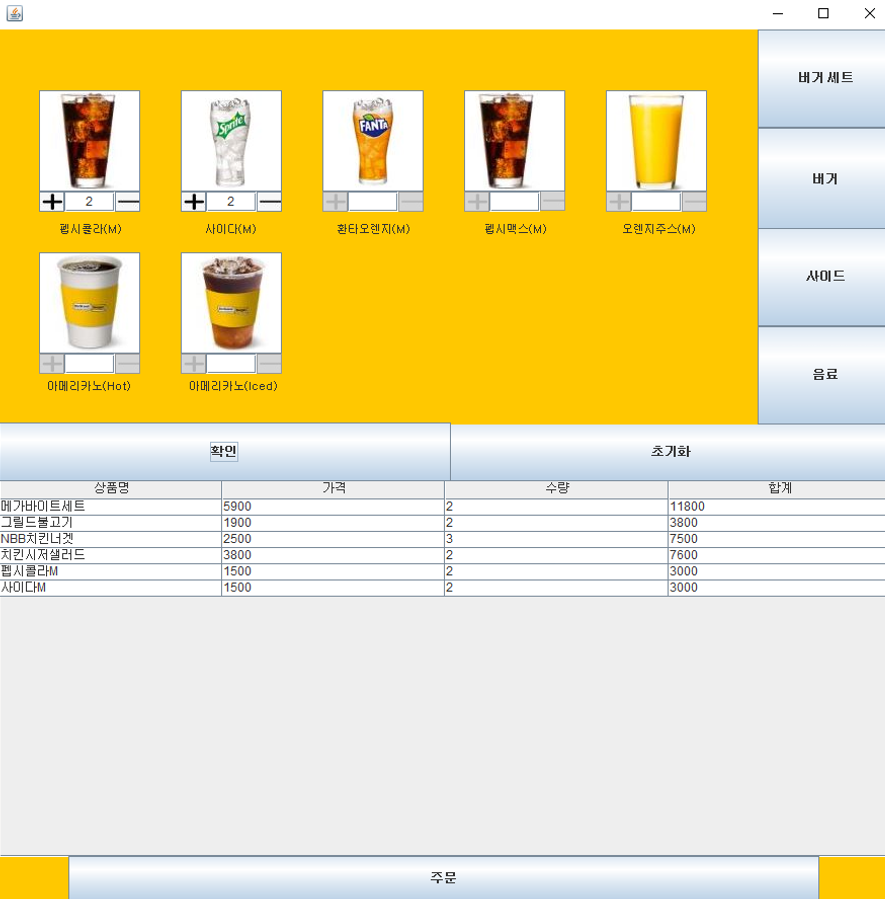

# <JAVA 프로젝트>
이 저장소는 JAVA Swing 사용한 노브랜드버거 무인 키오스크 프로젝트를 저장한 곳입니다.
- JAVA는 Eclipse에서 사용한 환경에서 진행하였습니다.
- DataBase는 Oracle SQL를 사용한 환경에서 진행하였습니다.

## 소개
- JAVA
    - 기본 폼과 폼 위에 패널 구현
    - 주문 : 메뉴 선택, 선택 메뉴 수량 및 금액 표시, 주문 버튼 클릭 시 DB에 저장
    - 조회 : 선택한 일자에 판매한 제품군 표시, 총 판매 수량 및 총 판매액 표시 구현
    - 영수증 : 주문 버튼 클릭 시 영수증 txt파일 생성 구현
    - 관리자 : 주문창에서 관리자 모드로 전환 구현
- Oracle SQL
    - SQL Developer를 활용하여 DB 관리
